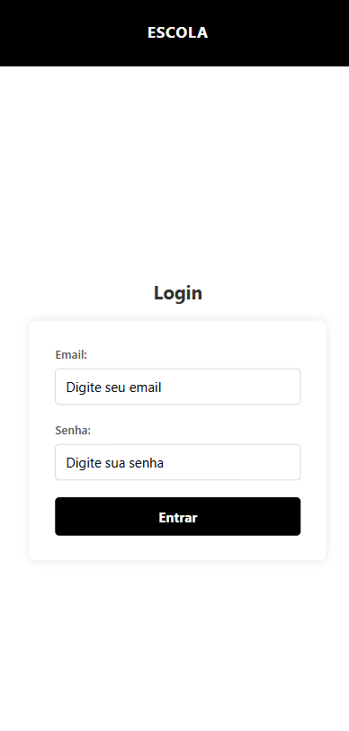
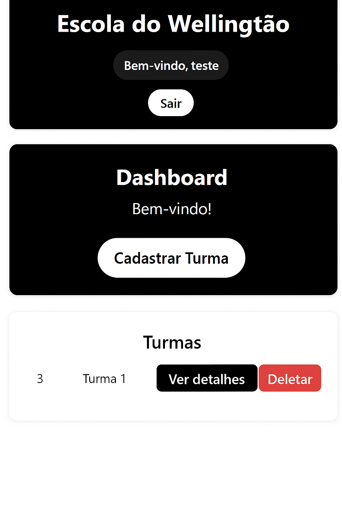
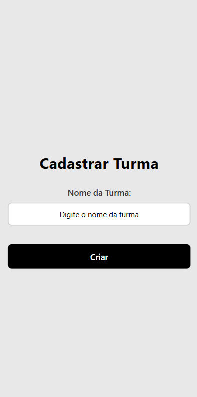
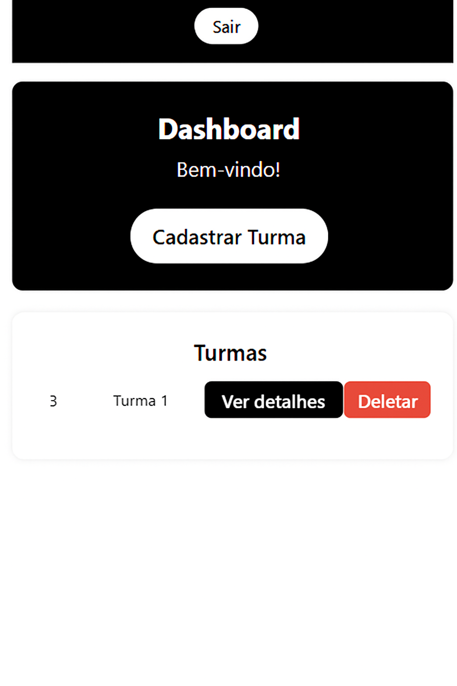
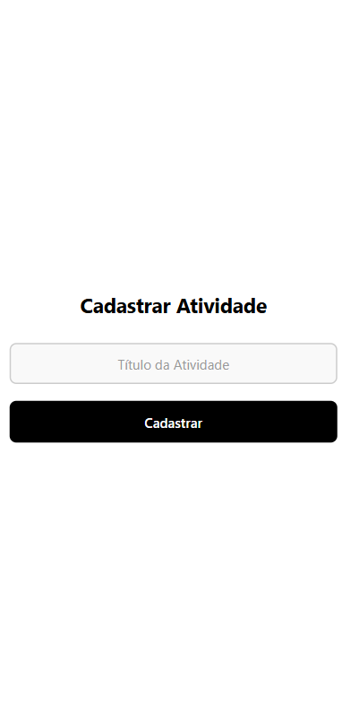

# Sistema Mobile: Gerenciamento de Turmas e Atividades

### Objetivo

Este projeto tem como meta desenvolver um **aplicativo móvel completo** (front-end React Native + back-end Node.js) voltado ao gerenciamento de turmas e atividades de professores.
O app permite que o docente cadastre, visualize e remova turmas e atividades de forma simples e centralizada.

### Cenário

Em diversas instituições, principalmente em regiões com acesso limitado a ferramentas digitais, a organização das atividades pedagógicas pode ser prejudicada.
Um aplicativo que centralize o gerenciamento de turmas e atividades facilita o acompanhamento e contribui para a eficiência do processo de ensino-aprendizagem.

### Funcionalidades

* Realizar login com credenciais do professor;
* Registrar, consultar e remover turmas;
* Cadastrar atividades vinculadas às turmas;
* Efetuar logout com segurança.

---

## Requisitos Técnicos do Ambiente

### 1. Banco de Dados

* **SGBD:** MySQL
* **Versão recomendada:** 8.0 ou superior
* **Observação:** Criar um banco de dados específico para o projeto com usuário e senha configurados.

### 2. Servidor / Sistema Operacional

* **Sistema Operacional:** Windows 10/11, Linux (Ubuntu 20.04 ou superior) ou macOS
* **Servidor de Aplicação:** Node.js
* **Versão recomendada do Node.js:** 18.x ou superior

### 3. Linguagens e Frameworks

* **Front-end Mobile:** React Native
* **Back-end:** Node.js, Express, Prisma ORM
* **Banco de dados:** MySQL

---

## Instalação e Execução

### 1. Clonar o Repositório

```bash
git clone https://github.com/lucashasmann/escolaavaliacao.git
cd escolaavaliacao
```

### 2. Instalar Dependências

```bash
npm install
# ou
npm i
```

### 3. Configurar Banco de Dados

* Crie um banco de dados MySQL específico para o projeto.
* Configure o arquivo `.env`:

```env
DATABASE_URL="mysql://root@localhost:3306/nome_do_banco"
```

### 4. Rodar Migrations do Prisma

```bash
npx prisma migrate dev --name init
```

### 5. Iniciar o Servidor Back-end

```bash
npm run dev
```

O servidor estará disponível em `http://localhost:3000`.

### 6. Executar o App Mobile

```bash
npx expo start
```

* Teste o aplicativo em um emulador ou dispositivo físico via QR code.

### 7. Funcionalidades para Testar

* Cadastro, listagem e exclusão de turmas;
* Cadastro, listagem e exclusão de atividades;
* Login e logout do professor.

---

## Capturas de Tela

### 1. Tela de Login



### 2. Tela de Dashboard



### 3. Tela de Cadastrar Turma



### 4. Tela de Atividades



### 5. Tela de Cadastrar Atividade



---

> **Observação:** Coloque as imagens das telas na pasta `screenshots` no diretório raiz do projeto.
